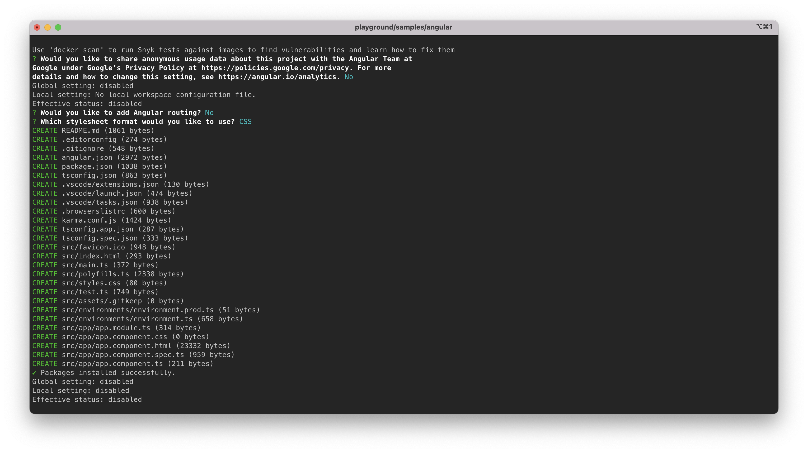
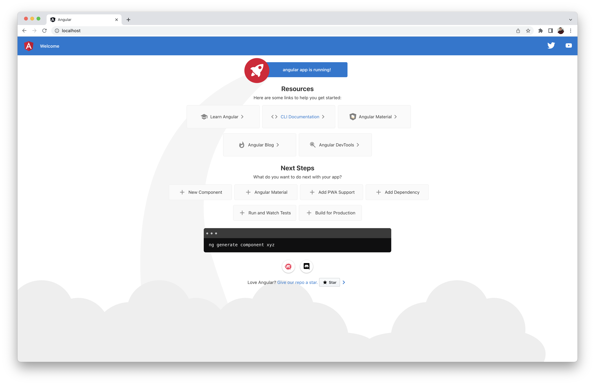

<h5 align="center">
  Playground Angular sample.
</h5>

---

<p align="center">
  
</p>

<h4 align="center">
  Angular is a TypeScript-based web application framework.
</h4>

<p align="center">
  <a href="#about">About</a> •
  <a href="#disclaimer">Disclaimer</a> •
  <a href="#getting-started">Getting Started</a> •
  <a href="#download">Download</a> •
  <a href="#how-to-use">How To Use</a> •
  <a href="#ide-plugins">IDE Plugins</a>
</p>

---

<p align="center">
  
  
  
  
  
</p>

## About

[Angular](https://angular.io/) is a platform and component-based framework for 
building scalable web (single-page) applications. Angular is written in 
TypeScript. Angular offers a collection of well-integrated libraries that cover 
a range of features, including routing, forms management, client-server 
communication, and more.

If you want to learn more about Angular, read the documentation at 
[https://angular.io/docs](https://angular.io/docs).

## Disclaimer

> **Note**
> : The ***Playground's*** Angular sample is intended for use in local 
development environments such as prototyping, tinkering with software stacks, 
etc. This sample <ins>**MUST NOT**</ins> be deployed in production environments.

## Getting Started

You will need to make sure your system meets the following prerequisites:

- Docker Engine >= 20.10.0

This repository utilizes [Docker](https://www.docker.com/) to run the Angular 
sample. So, before using the Angular sample, make sure you have Docker 
installed on your system.

## Download

To use the Angular sample, you can clone the latest version of ***Playground*** 
repository for macOS, Linux and Windows.

```bash
# Clone this repository.
$ git clone git@github.com:luisaveiro/playground.git --branch main --single-branch
```

You can locate the Angular sample in the `samples` directory.

```bash
# Navigate to the Angular sample
$ cd playground/samples/angular
```

#### <ins>Directory structure</ins>

Below is the directory structure for the Angular sample.

```
.
+-- .env.example
+-- .gitignore
+-- compose.yml
+-- Dockerfile
+-- Makefile
+-- README
```

Let's cover the main files of the Angular sample.

- **.env.example**  
The Angular sample includes a DotEnv example file. By creating a DotEnv file, 
you can override the Docker Compose variables with ease.

- **compose.yml**  
The Docker Compose file defines the services, networks, and volumes for the 
Angular sample.

- **Dockerfile**  
The Dockerfile is used to install Angular CLI, allowing you to create projects, 
generate application and library code, and perform a range of ongoing 
development tasks.

- **Makefile**  
The Makefile offers a developer-friendly approach to automate the set up of 
the Angular sample.

#### <ins>Docker Image</ins>

This Angular sample utilizes the `node:18-alpine` image variant of the official 
Node.js Docker image. If you want to learn to use the official Node.js Docker 
image including available image variants and environment variables, you can 
read the [Node Docker Hub](https://hub.docker.com/_/node) guide.

## How To Use

There are a few steps you need to follow before you can have an Angular project 
set up and running in Docker container. I have outline the steps you would need 
to take to get started.

#### 1. <ins>Configuring your DotEnv file | *optional*</ins>

If you want to change the container name, network name or the source code 
folder, you can create a DotEnv file and override the Docker Compose variables.

***Playground*** includes a `.env.example` file for the Angular sample. You can 
run the following command in the terminal to create your DotEnv file.

```bash
# Create .env from .env.example.
$ cp .env.example .env
```

The DotEnv file is split into 3 sections: `container`, `network` & `volume` 
environment configurations. Below I have provided a snapshot on each section's 
environment variables.

##### Container env

```ini
#--------------------------------------------------------------------------
# Container env
#--------------------------------------------------------------------------

# The project name. | default: angular
APP_NAME="angular"

# The Angular app container name. | default: angular_app
APP_CONTAINER_NAME="${APP_NAME}_app"
```

##### Network env

```ini
#--------------------------------------------------------------------------
# Network env
#--------------------------------------------------------------------------

# Map the app container exposed port to the host port. | default: 80
APP_PORT=80

# The Docker network for the container. | default: angular_local
NETWORK_NAME="${APP_NAME}_local"
```

##### Volume env

```ini
#--------------------------------------------------------------------------
# Volume env
#--------------------------------------------------------------------------

# The project source code directory. | default: /code
CODE_DIR=/code
```

#### 2. <ins>Build Docker image | *optional*</ins>

You need Angular CLI installed in your Docker container to build and serve your 
app. Currently, there is no official Angular Docker image. I have included a 
Dockerfile that builds a Docker image with Angular CLI installed.

The Docker Compose file and Makefile automatically build the Docker image from 
the Dockerfile. However, if you want to build the Docker image, you can run the 
following command:

```bash
$ docker build -t angular .
```

The Docker image will be tagged as `angular:latest`.

#### 3. <ins>Create a new Angular project</ins>

To create a new Angular project, you can use the Angular CLI `ng new` command 
that offers an initial starter app. The ***Playground's*** Angular sample 
includes a Makefile that offers a developer-friendly approach to executing 
the `ng new` command in a Docker container.

You can run the following make command:

```bash
$ make angular
```

The Makefile builds the Docker image from the Dockerfile and executes the 
`ng new` command. You will need to follow the Angular CLI installation steps. 
Below is a screenshot of the Angular CLI installation completed:

<p align="center">
  <a>
    
  </a>
  <br>
  <sub><sup>Angular CLI installation</sup></sub>
</p>

The Makefile will create and attach the `CODE_DIR` (default `/code` directory) 
as a Docker volume. Your new Angular project will be stored in the `CODE_DIR`.

#### 4. <ins>Start Angular container</ins>

To start the the Angular container, you can run the following command:

```bash
$ docker compose up

# or run container in detached mode
$ docker compose up -d
```

##### Expected result

To check the Angular container is running and the port mapping is configured 
correctly, you can run the following command:

```bash
# List containers
$ docker ps  
```

You should see a similar output.

```bash
CONTAINER ID   IMAGE            COMMAND                  CREATED          STATUS         PORTS                NAMES
52c08a71dfcd   angular:latest   "docker-entrypoint.s…"   11 seconds ago   Up 6 seconds   0.0.0.0:80->80/tcp   angular_app
```

#### 5. <ins>Accessing Angular sample</ins>

Once the Angular container is up and running, you can access Angular sample in 
your web browser at http://localhost (default port 80). If you have overridden 
the `APP_PORT` in the DotEnv file, you will need to provide the overridden port.

Below is a screenshot of the Angular welcome page:

<p align="center">
  <a>
    
  </a>
  <br>
  <sub><sup>Angular welcome page</sup></sub>
</p>

#### 6. <ins>Stop Angular container</ins>

To stop the Angular container, you can run the following command:

```bash
$ docker-compose down
```

## IDE Plugins

[Angular Language Service](https://angular.io/guide/language-service) provides 
code editors with a way to get completions, errors, hints, and navigation 
inside Angular templates. It works with external templates in separate HTML 
files, and also with in-line templates. Angular Language Service is currently 
available as an extension for Visual Studio Code, WebStorm, Sublime Text and 
Eclipse IDE.

---

<p align="center">
  <a href="http://github.com/luisaveiro" target="_blank">GitHub</a> •
  <a href="https://uk.linkedin.com/in/luisaveiro" target="_blank">LinkedIn</a> •
  <a href="https://twitter.com/luisdeaveiro" target="_blank">Twitter</a>
</p>
