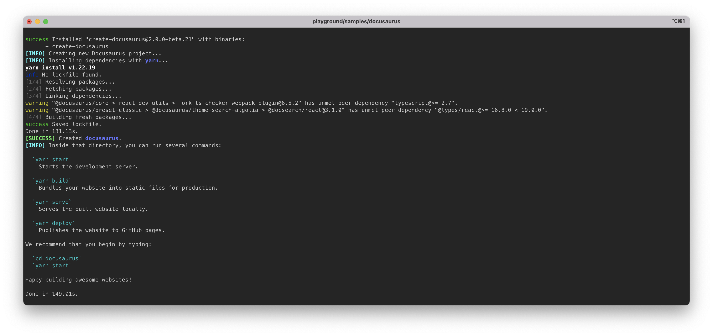
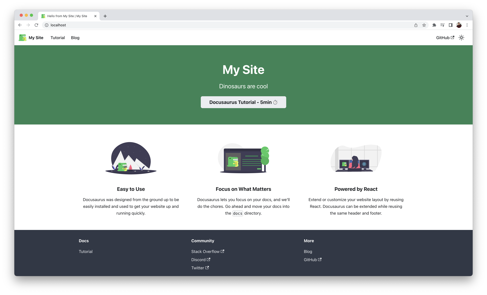

<h5 align="center">
  Playground Docusaurus sample.
</h5>

---
<p align="center">
  
</p>

<h4 align="center">
  Docusaurus is a static-site generator.
</h4>

<p align="center">
  <a href="#about">About</a> •
  <a href="#disclaimer">Disclaimer</a> •
  <a href="#getting-started">Getting Started</a> •
  <a href="#download">Download</a> •
  <a href="#how-to-use">How To Use</a>
</p>

---

<p align="center">
  
  
  
  
  
</p>

## About

[Docusaurus](https://docusaurus.io/) is a static-site generator. It builds a 
single-page application with fast client-side navigation, leveraging the full 
power of React to make your site interactive. It provides out-of-the-box 
documentation features but can be used to create any kind of site (personal 
website, product, blog, marketing landing pages, etc).

If you want to learn more about Docusaurus, read the documentation at 
[https://docusaurus.io/docs](https://docusaurus.io/docs).

## Disclaimer

> **Note**
> : The ***Playground's*** Docusaurus sample is intended for use in local 
development environments such as prototyping, tinkering with software stacks, 
etc. This sample <ins>**must not**</ins> be deployed in production environments.

## Getting Started

You will need to make sure your system meets the following prerequisites:

- Docker Engine >= 20.10.0

This repository utilizes [Docker](https://www.docker.com/) to run the 
Docusaurus sample. So, before using the Docusaurus sample, make sure you have 
Docker installed on your system.

## Download

To use the Docusaurus sample, you can clone the latest version of 
***Playground*** repository for macOS, Linux and Windows.

```bash
# Clone this repository.
$ git clone git@github.com:luisaveiro/playground.git --branch main --single-branch
```

You can locate the Docusaurus sample in the `samples` directory.

```bash
# Navigate to Docusaurus sample
$ cd playground/samples/docusaurus
```

#### <ins>Directory structure</ins>

Below is the directory structure for the Docusaurus sample.

```
.
+-- .env.example
+-- .gitignore
+-- compose.yml
+-- Makefile
+-- README
```

Let's cover the main files of the Docusaurus sample.

- **.env.example**  
The Docusaurus sample includes a DotEnv example file. By creating a DotEnv file, 
you can override the Docker Compose variables with ease.

- **compose.yml**  
The Docker Compose file defines the services, networks, and volumes for the 
Docusaurus sample.

- **Makefile**  
The Makefile provides a developer-friendly approach to automate the set up of 
the Docusaurus sample.

#### <ins>Docker Image</ins>

This Docusaurus sample utilizes the `node:18-alpine` image variant of the official 
Node.js Docker image. If you want to learn to use the official Node.js Docker 
image including available image variants and environment variables, you can 
read the [Node Docker Hub](https://hub.docker.com/_/node) guide.

## How To Use

There are a few steps you need to follow before you can have Docusaurus project 
set up and running in Docker container. I have outline the steps you would need 
to take to get started.

#### 1. <ins>Configuring your DotEnv file | *optional*</ins>

If you want to change the container name, network name or the source code 
folder, you can create a DotEnv file and override the Docker Compose variables.

***Playground*** includes a `.env.example` file for the Docusaurus sample. You 
can run the following command in the terminal to create your DotEnv file.

```bash
# Create .env from .env.example.
$ cp .env.example .env
```

The DotEnv file is split into 3 sections: `container`, `network` & `volume` 
environment configurations. Below I have provided a snapshot on each section's 
environment variables.

```ini
#--------------------------------------------------------------------------
# Container env
#--------------------------------------------------------------------------

# The project name. | default: docusaurus
APP_NAME="docusaurus"

# The Docusaurus app container name. | default: docusaurus_app
APP_CONTAINER_NAME="${APP_NAME}_app"
```

##### Network env

```ini
#--------------------------------------------------------------------------
# Network env
#--------------------------------------------------------------------------

# Map the app container exposed port to the host port. | default: 80
APP_PORT=80

# The Docker network for the container. | default: docusaurus_local
NETWORK_NAME="${APP_NAME}_local"
```

##### Volume env

```ini
#--------------------------------------------------------------------------
# Volume env
#--------------------------------------------------------------------------

# The project source code directory. | default: /code
CODE_DIR=/code
```

#### 2. <ins>Create a new Docusaurus project</ins>

To create a new Docusaurus project, you can use the Docusaurus' Yarn starter 
kit that offers an initial starter app. The ***Playground's*** Docusaurus 
sample includes a Makefile that offers a developer-friendly approach to 
executing the `yarn create <starter-kit-package>` command in a Docker container.

Docusaurus offers two templates **classic** and **facebook** to help you 
scaffold a new skeleton Docusaurus website. The Makefile provides the 
Docusaurus templates as targets. You can run one of the make commands:

```bash
# Use Docusaurus classic template.
$ make docusaurus-classic

# Use Docusaurus facebook template.
$ make docusaurus-facebook
```

The Docusaurus classic template supports TypeScript. If you want to use 
TypeScript with the classic template, you can use the following make command:

```bash
# Docusaurus classic template with TypeScript support.
$ make docusaurus-classic-ts
```

The Makefile executes the `yarn create docusaurus` command. Below is a 
screenshot of the Docusaurus CLI installation completed:

<p align="center">
  <a>
    
  </a>
  <br>
  <sub><sup>Docusaurus CLI installation</sup></sub>
</p>

The Makefile will create and attach the `CODE_DIR` (default `/code` directory) 
as a Docker volume. Your new Docusaurus project will be stored in the `CODE_DIR`.

#### 3. <ins>Start Docusaurus container</ins>

To start the the Docusaurus container, you can run the following command:

```bash
$ docker compose up

# or run container in detached mode
$ docker compose up -d
```

##### Expected result

To check the Docusaurus container is running and the port mapping is configured 
correctly, you can run the following command:

```bash
# List containers
$ docker ps  
```

You should see a similar output.

```bash
CONTAINER ID   IMAGE            COMMAND                  CREATED         STATUS        PORTS                NAMES
896c718c4435   node:18-alpine   "docker-entrypoint.s…"   7 seconds ago   Up 1 second   0.0.0.0:80->80/tcp   docusaurus_app
```

#### 4. <ins>Accessing Astro sample</ins>

Once the Docusaurus container is up and running, you can access Docusaurus 
sample in your web browser at http://localhost (default port 80). If you have 
overridden the `APP_PORT` in the DotEnv file, you will need to provide the 
overridden port.

Below is a screenshot of the Docusaurus welcome page from the classic template:

<p align="center">
  <a>
    
  </a>
  <br>
  <sub><sup>Docusaurus welcome page</sup></sub>
</p>

#### 5. <ins>Stop Docusaurus container</ins>

To stop the Docusaurus container, you can run the following command:

```bash
$ docker-compose down
```

---

<p align="center">
  <a href="http://github.com/luisaveiro" target="_blank">GitHub</a> •
  <a href="https://uk.linkedin.com/in/luisaveiro" target="_blank">LinkedIn</a> •
  <a href="https://twitter.com/luisdeaveiro" target="_blank">Twitter</a>
</p>
