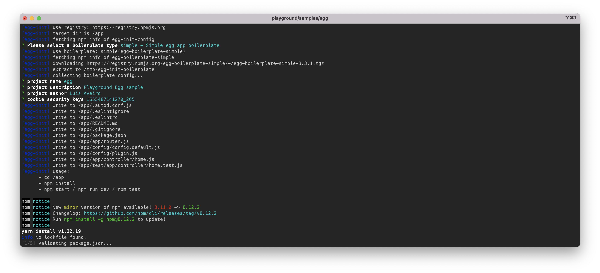
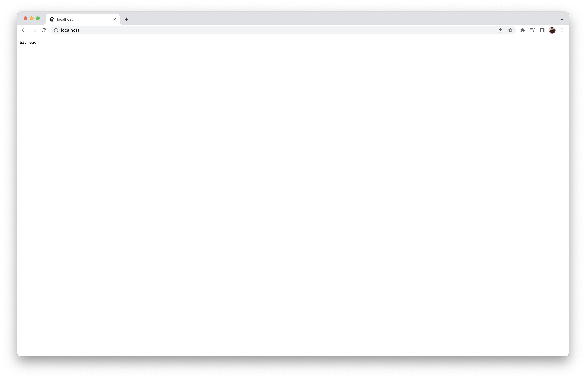

<h5 align="center">
  Playground Docusaurus sample.
</h5>

---

<p align="center">
 
</p>

<h4 align="center">
  Egg is a web framework's framework for Node.js.
</h4>

<p align="center">
  <a href="#about">About</a> •
  <a href="#disclaimer">Disclaimer</a> •
  <a href="#getting-started">Getting Started</a> •
  <a href="#download">Download</a> •
  <a href="#how-to-use">How To Use</a>
</p>

---

<p align="center">
   
  
  
  
  
</p>

## About

[Egg](https://www.eggjs.org/) is a convention-over-configuration framework and 
is built around the Koa. Egg helps developers to build better enterprise 
frameworks and apps with Node.js & Koa.

If you want to learn more about Egg, read the documentation at 
[https://www.eggjs.org/intro](https://www.eggjs.org/intro).

## Disclaimer

> **Note**
> : The ***Playground's*** Egg sample is intended for use in local 
development environments such as prototyping, tinkering with software stacks, 
etc. This sample <ins>**must not**</ins> be deployed in production environments.

## Getting Started

You will need to make sure your system meets the following prerequisites:

- Docker Engine >= 20.10.0

This repository utilizes [Docker](https://www.docker.com/) to run the Egg 
sample. So, before using the Egg sample, make sure you have Docker installed 
on your system.

## Download

To use the Egg sample, you can clone the latest version of ***Playground*** 
repository for macOS, Linux and Windows.

```bash
# Clone this repository.
$ git clone git@github.com:luisaveiro/playground.git --branch main --single-branch
```

You can locate the Egg sample in the `samples` directory.

```bash
# Navigate to Egg sample
$ cd playground/samples/egg
```

#### <ins>Directory structure</ins>

Below is the directory structure for the Egg sample.

```
.
+-- .env.example
+-- .gitignore
+-- compose.yml
+-- Makefile
+-- README
```

Let's cover the main files of the Egg sample.

- **.env.example**  
The Egg sample includes a DotEnv example file. By creating a DotEnv file, 
you can override the Docker Compose variables with ease.

- **compose.yml**  
The Docker Compose file defines the services, networks, and volumes for the 
Egg sample.

- **Makefile**  
The Makefile provides a developer-friendly approach to automate the set up of 
the Egg sample.

#### <ins>Docker Image</ins>

This Egg sample utilizes the `node:18-alpine` image variant of the official 
Node.js Docker image. If you want to learn to use the official Node.js Docker 
image including available image variants and environment variables, you can 
read the [Node Docker Hub](https://hub.docker.com/_/node) guide.

## How To Use

There are a few steps you need to follow before you can have Egg project set 
up and running in Docker container. I have outline the steps you would need to 
take to get started.

#### 1. <ins>Configuring your DotEnv file | *optional*</ins>

If you want to change the container name, network name or the source code 
folder, you can create a DotEnv file and override the Docker Compose variables.

***Playground*** includes a `.env.example` file for the Egg sample. You can 
run the following command in the terminal to create your DotEnv file.

```bash
# Create .env from .env.example.
$ cp .env.example .env
```

The DotEnv file is split into 3 sections: `container`, `network` & `volume` 
environment configurations. Below I have provided a snapshot on each section's 
environment variables.

```ini
#--------------------------------------------------------------------------
# Container env
#--------------------------------------------------------------------------

# The project name. | default: egg
APP_NAME="egg"

# The Egg app container name. | default: egg_app
APP_CONTAINER_NAME="${APP_NAME}_app"
```

##### Network env

```ini
#--------------------------------------------------------------------------
# Network env
#--------------------------------------------------------------------------

# Map the app container exposed port to the host port. | default: 80
APP_PORT=80

# The Docker network for the container. | default: egg_local
NETWORK_NAME="${APP_NAME}_local"
```

##### Volume env

```ini
#--------------------------------------------------------------------------
# Volume env
#--------------------------------------------------------------------------

# The project source code directory. | default: /code
CODE_DIR=/code
```

#### 2. <ins>Create a new Egg project</ins>

To create a new Egg project, you can use the Egg's NPM starter kit that 
offers an initial starter app. The ***Playground's*** Egg sample includes a 
Makefile that offers a developer-friendly approach to executing the 
`npm init <starter-kit-package>` command in a Docker container.

You can run the following make command:

```bash
$ make egg
```

The Makefile executes the `npm init egg` command. You will need to follow 
the Egg CLI installation steps. Below is a screenshot of the Egg CLI 
installation completed:

<p align="center">
  <a>
    
  </a>
  <br>
  <sub><sup>Egg CLI installation</sup></sub>
</p>

The Makefile will create and attach the `CODE_DIR` (default `/code` directory) 
as a Docker volume. Your new Egg project will be stored in the `CODE_DIR`.

#### 3. <ins>Start Egg container</ins>

To start the the Egg container, you can run the following command:

```bash
$ docker compose up

# or run container in detached mode
$ docker compose up -d
```

##### Expected result

To check the Egg container is running and the port mapping is configured 
correctly, you can run the following command:

```bash
# List containers
$ docker ps  
```

You should see a similar output.

```bash
CONTAINER ID   IMAGE            COMMAND                  CREATED         STATUS         PORTS                NAMES
a4a6037552bb   node:18-alpine   "docker-entrypoint.s…"   4 seconds ago   Up 2 seconds   0.0.0.0:80->80/tcp   egg_app
```

#### 4. <ins>Accessing Egg sample</ins>

Once the Egg container is up and running, you can access Egg sample in 
your web browser at http://localhost (default port 80). If you have overridden 
the `APP_PORT` in the DotEnv file, you will need to provide the overridden port.

Below is a screenshot of the Egg welcome page:

<p align="center">
  <a>
    
  </a>
  <br>
  <sub><sup>Egg welcome page</sup></sub>
</p>

#### 5. <ins>Stop Egg container</ins>

To stop the Egg container, you can run the following command:

```bash
$ docker-compose down
```

---

<p align="center">
  <a href="http://github.com/luisaveiro" target="_blank">GitHub</a> •
  <a href="https://uk.linkedin.com/in/luisaveiro" target="_blank">LinkedIn</a> •
  <a href="https://twitter.com/luisdeaveiro" target="_blank">Twitter</a>
</p>
